 

<table>
<tr>
<td valign="top" width="52%">

### Sobre mí

Estudiante en **42 Barcelona**, con formación previa como **Tecnico de redes y sistemas** en **EDT BCN**, **Desarollador de aplicaciones multiplataforma** en **ITIC BCN**. Trabajo principalmente en sistemas, redes y programación de bajo nivel, con un enfoque práctico orientado a proyectos y resolución de problemas reales antes que a la teoría por sí sola.

 

| | |
|---|---|
| `EDUCACIÓN` | 42 Barcelona |
| `FORMACIÓN` | Técnico en redes y sistemas (SMX) — EDT BCN |
| `FROMACÍON` | Desarollador de aplicacion multiplataforma (DAM) - ITIC BCN |
| `ENFOQUE` | Sistemas y Redes |
| `UBICACIÓN` | Barcelona, España |

 

**STACK**

 

**CONTACTO**

</td>
<td align="center" width="48%">

</td>
</tr>
</table>

 

<b>ACTUALMENTE</b>

 

- Cursando el cursus de 42 Barcelona (piscina / proyectos comunes)
- En paralelo, cursando el CFGS DAM (Desenvolupament d'Aplicacions Multiplataforma) en ITIC BCN
- Reforzando fundamentos de C, algoritmia y estructuras de datos
- Profundizando en redes, administración de sistemas Linux y seguridad ofensiva básica

<b>CÓMO TRABAJO</b>

 

Prefiero entender el problema antes que memorizar una solución. La formación en 42 refuerza esto por diseño: sin clases, sin profesores, aprendizaje entre pares y evaluación por proyectos. La base en ciberseguridad (SMX) le suma una capa extra de rigor — pensar en cómo se rompe un sistema ayuda a entender cómo construirlo bien.

<b>DESAROLLADOR DE APLICACIONES MULTIPLATAFROMA (ITIC BCN)</b>

 

Formación técnica centrada en seguridad de redes, sistemas y análisis de vulnerabilidades — la base sobre la que ahora construyo con una formación más orientada a desarrollo y sistemas en 42 Barcelona.

 

  

zg // unique_visits 

