 

<table>
<tr>
<td valign="top" width="52%">

### Sobre mí

Estudiante en **42 Barcelona**, con formación previa como **Técnico en Ciberseguridad (SMX)** en **EDT BCN**. Trabajo principalmente en sistemas, redes y programación de bajo nivel, con un enfoque práctico orientado a proyectos y resolución de problemas reales.

 

| | |
|---|---|
| `EDUCACIÓN` | 42 Barcelona |
| `FORMACIÓN` | Técnico en Ciberseguridad (SMX) — EDT BCN |
| `ENFOQUE` | Sistemas y Redes |
| `UBICACIÓN` | Barcelona, España |

 

**STACK**

 

**CONTACTO**

</td>
<td align="center" width="48%">

</td>
</tr>
</table>

 

  

