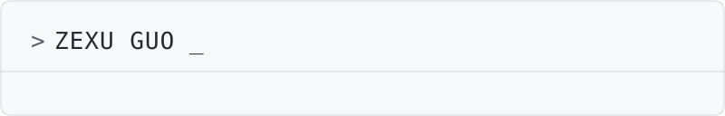

 

<table>
<tr>
<td valign="top" width="52%">

### About me

Student at **42 Barcelona**, in parallel with the **DAM** program at **ITIC BCN**, with a prior technical background as a **Systems & Networks Technician (SMX)** from **EDT BCN**. I mostly work on systems, networking and low-level programming, with a practical, project-first approach over theory for its own sake.

 

| | |
|---|---|
| `EDUCATION` | 42 Barcelona (2026 — present) |
| `EDUCATION` | Multiplatform App Development (DAM) — ITIC BCN (2026–2029) |
| `BACKGROUND` | Systems & Networks Technician (SMX) — EDT BCN (2024–2026) |
| `FOCUS` | Systems & Networking |
| `LOCATION` | Barcelona, Spain |

 

**STACK**

 

**CONTACT**

</td>
<td align="center" width="48%">

</td>
</tr>
</table>

 

<b>CURRENTLY</b>

 

- Going through the 42 Barcelona cursus (piscine / common core projects)
- In parallel, studying the DAM (Multiplatform App Development) program at ITIC BCN
- Strengthening fundamentals in C, algorithms and data structures
- Digging into networking, Linux system administration and basic offensive security

<b>HOW I WORK</b>

 

I'd rather understand a problem than memorize a solution. 42's format reinforces that by design: no classes, no teachers, peer learning and project-based evaluation. The systems & networking background from SMX adds an extra layer of rigor on top — thinking about how a system breaks helps you understand how to build it right.

<b>SYSTEMS & NETWORKS TECHNICIAN — SMX (EDT BCN, 2024–2026)</b>

 

Technical training focused on systems administration, networking and basic information security — the foundation I'm now building on with a more development- and low-level-oriented track at 42 Barcelona.

<b>DAM — ITIC BCN (2026–2029)</b>

 

Multiplatform App Development (DAM), studied in parallel with 42 Barcelona — goes deeper into multiplatform application development on top of the systems and low-level foundation built so far.

 

**PROJECTS**

 

<picture>
  <source media="(prefers-color-scheme: dark)" srcset="https://streak-stats.demolab.com/?user=zexuguo&theme=github-dark&hide_border=true&background=00000000" />
  <source media="(prefers-color-scheme: light)" srcset="https://streak-stats.demolab.com/?user=zexuguo&theme=default&hide_border=true&background=00000000" />
  
</picture>

  

<picture>
  <source media="(prefers-color-scheme: dark)" srcset="https://raw.githubusercontent.com/zexuguo/zexuguo/output/github-contribution-grid-snake-dark.svg" />
  <source media="(prefers-color-scheme: light)" srcset="https://raw.githubusercontent.com/zexuguo/zexuguo/output/github-contribution-grid-snake.svg" />
  
</picture>

  

zg // unique_visits 

