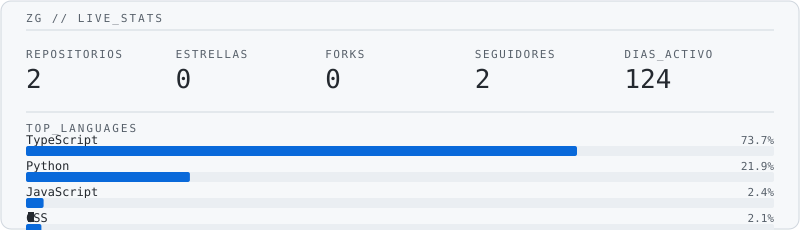

 

<table>
<tr>
<td valign="top" width="52%">

### Sobre mí

Estudiante en **42 Barcelona**, con formación previa como **Técnico en Sistemas y Redes (SMX)** en **EDT BCN**. Trabajo principalmente en sistemas, redes y programación de bajo nivel, con un enfoque práctico orientado a proyectos y resolución de problemas reales antes que a la teoría por sí sola.

 

| | |
|---|---|
| `EDUCACIÓN` | 42 Barcelona (2026 — actualidad) |
| `FORMACIÓN` | Técnico en Sistemas y Redes (SMX) — EDT BCN (2024–2026) |
| `PRÓXIMO` | Desenvolupament d'Aplicacions Multiplataforma (DAM) — ITIC BCN (2027) |
| `ENFOQUE` | Sistemas y Redes |
| `UBICACIÓN` | Barcelona, España |

 

**STACK**

 

**CONTACTO**

</td>
<td align="center" width="48%">

</td>
</tr>
</table>

 

<b>ACTUALMENTE</b>

 

- Cursando el cursus de 42 Barcelona (piscina / proyectos comunes)
- Reforzando fundamentos de C, algoritmia y estructuras de datos
- Profundizando en redes, administración de sistemas Linux y seguridad ofensiva básica

<b>CÓMO TRABAJO</b>

 

Prefiero entender el problema antes que memorizar una solución. La formación en 42 refuerza esto por diseño: sin clases, sin profesores, aprendizaje entre pares y evaluación por proyectos. La base en sistemas y redes (SMX) le suma una capa extra de rigor — pensar en cómo se rompe un sistema ayuda a entender cómo construirlo bien.

<b>TÉCNICO EN SISTEMAS Y REDES — SMX (EDT BCN, 2024–2026)</b>

 

Formación técnica centrada en administración de sistemas, redes y seguridad informática básica — la base sobre la que ahora construyo con una formación más orientada a desarrollo y bajo nivel en 42 Barcelona.

<b>PRÓXIMO: DAM — ITIC BCN (2027)</b>

 

Desenvolupament d'Aplicacions Multiplataforma (DAM), a continuación de 42 Barcelona — profundizará en desarrollo de aplicaciones multiplataforma sobre la base de sistemas y bajo nivel construida hasta ahora.

 

**PROYECTOS**

 

  

zg // unique_visits 

